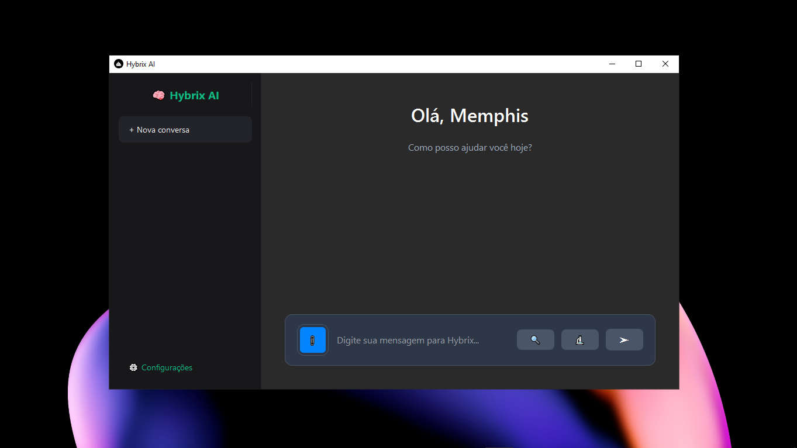

# Hybrix IA


> Uma inteligência artificial desenvolvida em python, com muito amor e noites não dormidas ❤☕

---

## Tecnologias

- Python 3
- Pandas
- Matplotlib
- PyQt6
- Requests
- API Rest
- Sentence Transformers
- Faiss
- OpenCV
- PyTesseract
- Pdf2Image
- PyMuPDF
- Google Generative Language API
- SerpAPI
- NumPy
- Base64

  
---

## Como utilizar

Siga os passos abaixo para instalar e configurar a IA:

### 1. Instale as dependências

Baixe as bibliotecas necessárias com o comando:

```bash
pip install -r requirements.txt
```

> O arquivo `requirements.txt` já está incluso no repositório.

---

### 2. Configure as APIs

A IA utiliza algumas APIs externas para funções de IA generativa e buscas na web.

- **Google Generative Language API (Gemini):**  
  Obtenha sua chave em: [Google AI Studio](https://aistudio.google.com/apikey)
- **SERPAPI:**  
  Crie sua conta e obtenha a chave gratuita em: [serpapi.com](https://serpapi.com/)

Após obter as chaves, abra o arquivo `main.py` e preencha as variáveis:
```python
GOOGLE_API_KEY = "SUA_API"
SERPAPI_KEY = "SUA_API"
```
Salve o arquivo após inserir suas chaves.

---

### 3. Execute o Hybrix_IA

No terminal, utilize:

```bash
python main.py
```

A interface gráfica será aberta automaticamente.

---

## Diferenciais

O **Hybrix IA** é muito mais do que um simples chatbot. Ele foi desenvolvido para proporcionar uma experiência de inteligência artificial realmente avançada, combinando múltiplos recursos em uma única plataforma intuitiva e eficiente. Confira alguns dos principais diferenciais:

- **Interface moderna e intuitiva:**  
  Desenvolvida com PyQt6, oferece uma experiência visual agradável, responsiva e fácil de usar, com histórico de conversas, splash screen animada e balões de chat personalizados.

- **IA generativa de ponta:**  
  Integração com a API Gemini (Google Generative Language), proporcionando respostas detalhadas, naturais e atualizadas com o que há de mais avançado em IA generativa.

- **Pesquisa web integrada:**  
  Responde perguntas com base em pesquisas automáticas na web (via SERPAPI), trazendo informações atualizadas, confiáveis e de múltiplas fontes.

- **Análise multimodal:**  
  Permite anexar e analisar imagens, PDFs e vídeos, realizando OCR avançado e interpretando conteúdos complexos automaticamente.

- **Memória inteligente e semântica:**  
  Salva fatos, insights e respostas importantes, utilizando busca semântica para resgatar informações relevantes em futuras interações.

- **Geração automática de gráficos:**  
  Ao pedir por dados tabulares ou análises, gráficos de barras ou pizzas são gerados automaticamente e exibidos na conversa, sem necessidade de código.

- **Deep Dive:**  
  Realiza pesquisas aprofundadas, detectando viés, sumarizando resultados e apresentando nível de confiança e qualidade das fontes.

- **Insights automáticos:**  
  Após cada pesquisa, a IA gera insights, análises e recomendações de forma autônoma, agregando ainda mais valor para o usuário.

---

## Créditos

O ícone utilizado neste projeto foi criado por [Setiawanap](https://www.flaticon.com/br/autores/setiawanap).  
Agradecimentos especiais pela disponibilização do material. ❤

---

## Screenshot


